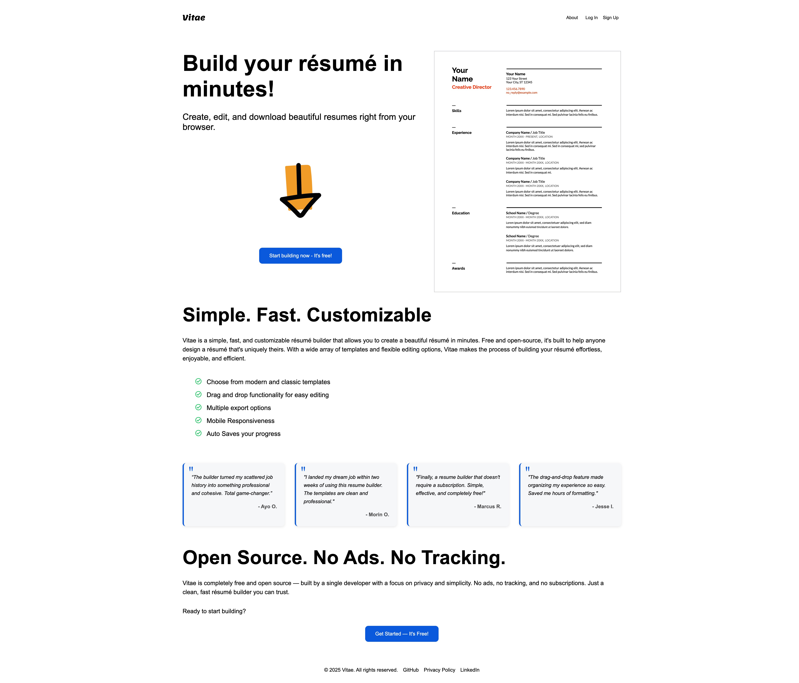
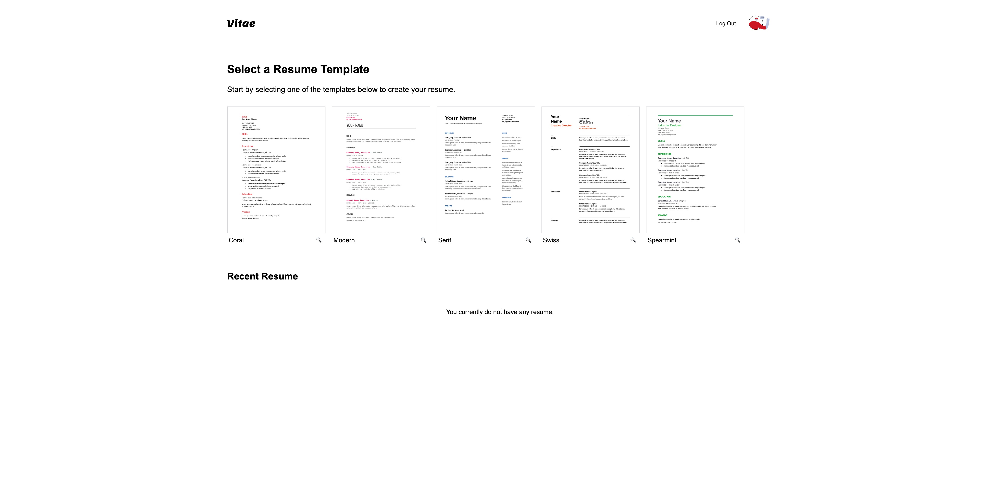
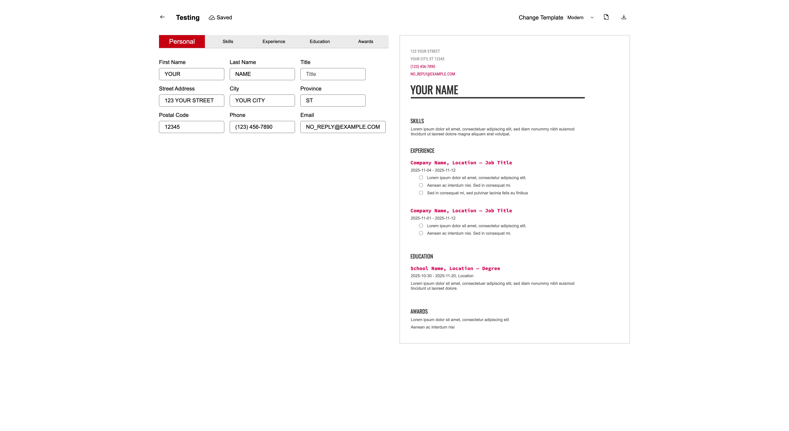
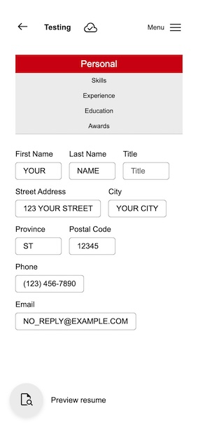

# Vitae - Resume Builder

A modern, free, and open-source resume builder built with React. Create beautiful resumes with multiple templates, drag-and-drop functionality, and export to PDF.

[](https://www.repostatus.org/#active)

## Features

- Multiple professional templates (Coral, Modern, Serif, Swiss, Spearmint)
- Fully responsive design
- Drag and drop functionality for easy editing
- PDF export with high-quality rendering
- Auto-save functionality
- Resume sharing capabilities
- Smooth animations and transitions
- No ads, no tracking, completely free

## Demo

Visit the live application: [Vitae](https://ayoroq.github.io/cv-application/)

## Screenshots

### Landing Page



### Template Selection



### Resume Editor



### Mobile View



## Technologies Used

- **React** - Frontend framework
- **CSS3** - Styling with custom properties and animations
- **jsPDF** - PDF generation
- **dom-to-image** - HTML to image conversion
- **Lottie React** - Animations
- **IndexedDB** - Client-side storage for temporary data persistence

## Getting Started

### Prerequisites

- Node.js (v14 or higher)
- npm or yarn

### Installation

1. Clone the repository

```bash
git clone https://github.com/Ayoroq/cv-application.git
cd cv-application
```

2. Install dependencies

```bash
npm install
```

3. Start the development server

```bash
npm start
```

4. Open [http://localhost:3000](http://localhost:3000) to view it in the browser

### Build for Production

```bash
npm run build
```

This creates an optimized build in the `build` folder.

## Browser Compatibility

- Chrome (recommended)
- Firefox
- Safari
- Edge

_Note: IndexedDB support required for data persistence_

## Known Limitations

⚠️ **Mobile PDF Export**: PDF generation and template thumbnails may not work optimally on mobile devices due to DOM rendering limitations with hidden elements on smaller screens. For best results, use a desktop or tablet browser when downloading resumes. This limitation will be resolved with proper backend integration in future updates.

## Project Structure

```
cv-application/
├── src/
│   ├── components/
│   │   ├── App.jsx
│   │   ├── LandingPage.jsx
│   │   └── ...
│   ├── templates/
│   │   └── previews/
│   ├── assets/
│   └── ...
├── public/
└── README.md
```

## Templates

The resume templates are inspired by professional designs found on Google Docs template gallery. Each template is carefully crafted to be ATS-friendly and visually appealing.

## Animations

Smooth animations are powered by [LottieFiles](https://lottiefiles.com/), providing engaging user interactions throughout the application.

## Data Storage

Vitae uses **IndexedDB** for client-side storage, ensuring your resume data is temporarily stored in your browser. This means:

- No server required for basic functionality
- Data persists between browser sessions
- Complete privacy - your data never leaves your device
- Works offline after initial load

## Typography

The application uses system fonts with fallbacks to Arial and Helvetica for optimal performance and compatibility across different devices.

## Future Enhancements

### Planned Features

- **Multiple Export Options**

  - Word document (.docx) export
  - Plain text export
  - HTML export
  - Image formats (PNG, JPEG)

- **Backend Integration**

  - User account creation and authentication
  - Cloud storage for resumes
  - Cross-device synchronization
  - Resume version history
  - Collaborative editing

- **Data Import/Export**

  - Import from LinkedIn profiles
  - Import from existing resume files (PDF, Word)
  - Import from JSON data files
  - Bulk data population from external sources

- **Additional Features**
  - More template designs
  - Custom color themes
  - Advanced formatting options
  - Resume analytics and tips
  - ATS optimization scoring

## Contributing

Contributions are welcome! Please feel free to submit a Pull Request.

### How to Contribute

1. Fork the project
2. Create your feature branch (`git checkout -b feature/AmazingFeature`)
3. Commit your changes (`git commit -m 'Add some AmazingFeature'`)
4. Push to the branch (`git push origin feature/AmazingFeature`)
5. Open a Pull Request

### Areas for Contribution

- New resume templates
- Additional export formats
- UI/UX improvements
- Performance optimizations
- Accessibility enhancements
- Bug fixes and testing

## License

This project is licensed under the MIT License - see the [LICENSE](LICENSE) file for details.

## Acknowledgments

- **The Odin Project** - This project was built as part of [The Odin Project](https://www.theodinproject.com/) curriculum
- **Google Docs** - Template designs inspired by Google Docs resume templates
- **LottieFiles** - Animation assets from the LottieFiles community
- **Google Fonts** - Typography resources

## Support

If you encounter any issues or have questions:

- Open an issue on [GitHub](https://github.com/Ayoroq/cv-application/issues)
- Check existing issues for solutions

## Author

Built by [Ayo](https://github.com/Ayoroq)

---

_This project is part of The Odin Project's JavaScript curriculum, focusing on React development and modern web application architecture._
